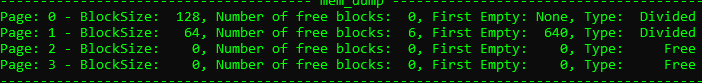
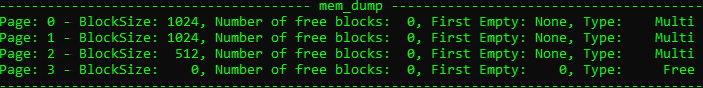
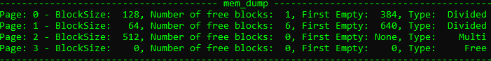
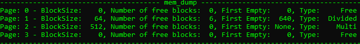
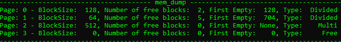

# Page Memory Allocator
Here is presented my C# implementation of **Page Memory Allocator** . 
All memory available to the allocator is divided into pages. The page size can be from 4 KB to several megabytes. All pages have the same size.
Information about pages stored in a **Descriptor**. This of descriptor is 12 bytes
Structure of descriptor: 
- [0-4] - index of next free block
- [4-8] - number of free blocks
- [8-12] - size of block

Pages is divided into 2 groups:
- Divided into blocks of the same size
- Used for allocating a block of memory bigger than half of the page

The first group in turn is divided into classes.
A class is determined by the size of the blocks in the page.
If block of the memory that should be allocated is not a power of two,
then the size of the block is equal to the next power of two.

 
## Examples
#### Allocation 
Allocate block with size than half of page

```
Allocator allocator = new Allocator();
allocator.mem_alloc(128);
allocator.mem_alloc(128);
allocator.mem_alloc(128);
allocator.mem_alloc(128);
allocator.mem_alloc(64);
allocator.mem_alloc(64);
allocator.mem_dump();
```

Result :    

Allocate block with size bigger than half of page
```
Allocator allocator = new Allocator();
allocator.mem_alloc(1024);
allocator.mem_alloc(512);
allocator.mem_dump();

```

Result :    


#### Memory Free
 Allocate
```
Allocator allocator = new Allocator();
int block1 = allocator.mem_alloc(128);
int block2 = allocator.mem_alloc(128);
int block3 = allocator.mem_alloc(128);
allocator.mem_alloc(64);
allocator.mem_alloc(64);
allocator.mem_alloc(512);
allocator.mem_dump();
```
   

Memory free : 
```
allocator.mem_free(ind1);
allocator.mem_free(ind2);
allocator.mem_free(ind3);
allocator.mem_free(ind4);
```

Result :    

#### Realloc

Allocate
```
Allocator allocator = new Allocator();
int block1 = allocator.mem_alloc(128);
int block2 = allocator.mem_alloc(128);
int block3 = allocator.mem_alloc(128);
allocator.mem_alloc(64);
allocator.mem_alloc(64);
allocator.mem_alloc(512);
allocator.mem_dump();
```
   


```
allocator.mem_realloc(64, block2);
allocator.mem_dump();
```
Result :    
